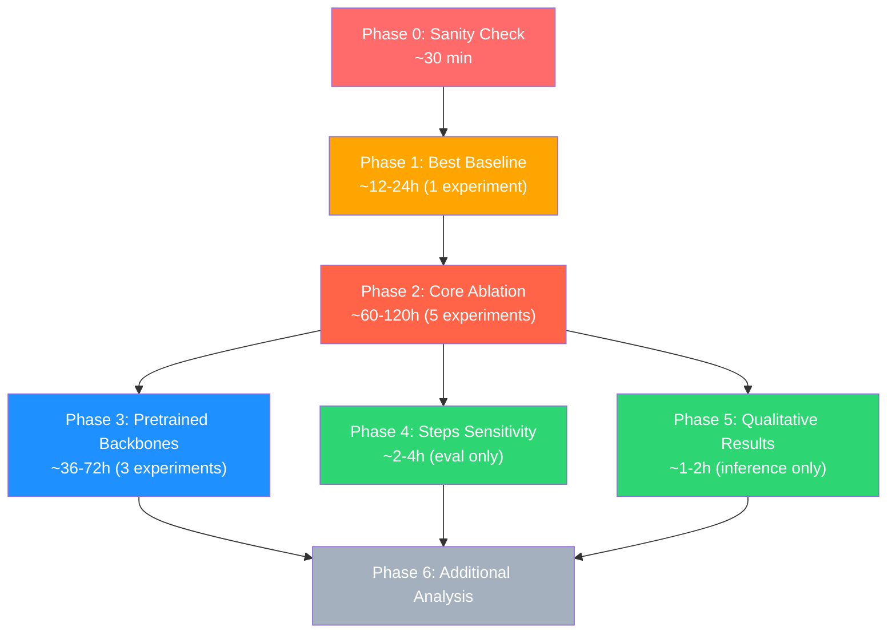

# 📋 Training Checklist — D3PM Pseudo-Label Denoiser Paper

> Thứ tự ưu tiên từ cao đến thấp. Mỗi phase phải hoàn thành trước khi chuyển sang phase tiếp theo.

---

## Phase 0: Sanity Check & Environment ⚡ (Ưu tiên TUYỆT ĐỐI)

> [!CAUTION]
> PHẢI hoàn thành phase này trước khi bắt đầu bất kỳ thí nghiệm nào.

- [ ] **Verify data pipeline**: chạy 1 batch qua dataset, kiểm tra shapes
  ```bash
  python -c "
  from diffusion_denoiser.datasets import build_dataset
  from mmcv import Config
  cfg = Config.fromfile('configs/denoiser/d3pm_concat_uniform_512x512_100k.py')
  ds = build_dataset(cfg.data.train)
  sample = ds[0]
  for k, v in sample.items():
      print(f'{k}: shape={v.shape}, dtype={v.dtype}, range=[{v.min():.2f}, {v.max():.2f}]')
  "
  ```
- [ ] **Verify data symlink**: `data/OEM_v2_aDanh` trỏ đúng đến thư mục thực tế
  ```bash
  ls -la data/OEM_v2_aDanh/
  wc -l data/OEM_v2_aDanh/train.txt data/OEM_v2_aDanh/val.txt data/OEM_v2_aDanh/test.txt
  ```
- [ ] **Overfit test (5-10 min)**: train 500 iters trên 1 batch nhỏ, kiểm tra loss giảm
  ```bash
  python tools/train.py configs/denoiser/d3pm_concat_uniform_512x512_100k.py \
      --work-dir work_dirs/sanity_check --cfg-options max_iters=500 data.samples_per_gpu=2
  ```
- [ ] **GPU memory check**: Xác nhận `samples_per_gpu=4` fits trong VRAM
- [ ] **Kiểm tra pretrained weights tồn tại**:
  ```bash
  ls pretrain/mit_b2.pth  # SegFormer-B2
  # ResNet-50 và ResNet-101 sẽ auto-download từ open-mmlab
  ```

---

## Phase 1: Baseline — Establish Main Result 🎯 (Ưu tiên CAO NHẤT)

> [!IMPORTANT]
> Đây là result quan trọng nhất trong paper. Cần chứng minh D3PM denoiser **cải thiện mIoU** so với pseudo-label gốc.

### Chọn 1 config chạy trước (recommend `crossattn + uniform`):

- [ ] **Train Exp #3**: CrossAttn + Uniform (thường cho kết quả tốt nhất trong diffusion models)
  ```bash
  python tools/train.py configs/denoiser/d3pm_crossattn_uniform_512x512_100k.py \
      --work-dir work_dirs/d3pm_crossattn_uniform --seed 42
  ```
  - Thời gian ước tính: ~12-24h cho 100k iters (tùy GPU)
  - Monitor: `tail -f work_dirs/d3pm_crossattn_uniform/train.log`

- [ ] **Evaluate baseline**:
  ```bash
  python tools/test.py configs/denoiser/d3pm_crossattn_uniform_512x512_100k.py \
      work_dirs/d3pm_crossattn_uniform/latest.pth --num-steps 50
  ```

- [ ] **Ghi nhận kết quả**: Pseudo mIoU vs Denoised mIoU → Δ mIoU

> **Mục tiêu**: Δ mIoU > 0 (denoised tốt hơn pseudo gốc). Nếu không đạt → debug trước khi tiếp tục.

---

## Phase 2: Core Ablation — Conditioning & Noise Type 📊 (Ưu tiên CAO)

> [!IMPORTANT]
> Đây là bảng ablation chính trong paper: **Table 1** — so sánh 3 conditioning × 2 noise types.

### Train 5 experiments còn lại (có thể song song nếu đủ GPU):

| # | Config | Command |
|---|--------|---------|
| 1 | Concat + Uniform | `python tools/train.py configs/denoiser/d3pm_concat_uniform_512x512_100k.py --work-dir work_dirs/d3pm_concat_uniform --seed 42` |
| 2 | Concat + Absorbing | `python tools/train.py configs/denoiser/d3pm_concat_absorbing_512x512_100k.py --work-dir work_dirs/d3pm_concat_absorbing --seed 42` |
| 4 | CrossAttn + Absorbing | `python tools/train.py configs/denoiser/d3pm_crossattn_absorbing_512x512_100k.py --work-dir work_dirs/d3pm_crossattn_absorbing --seed 42` |
| 5 | Hybrid + Uniform | `python tools/train.py configs/denoiser/d3pm_hybrid_uniform_512x512_100k.py --work-dir work_dirs/d3pm_hybrid_uniform --seed 42` |
| 6 | Hybrid + Absorbing | `python tools/train.py configs/denoiser/d3pm_hybrid_absorbing_512x512_100k.py --work-dir work_dirs/d3pm_hybrid_absorbing --seed 42` |

> **Hoặc chạy tất cả bằng script** (tự động tuần tự):
> ```bash
> bash tools/run_ablation.sh --gpus 1 --seed 42
> ```

- [ ] Train tất cả 6 configs (bao gồm #3 đã train ở Phase 1)
- [ ] Evaluate tất cả 6 configs
- [ ] Tạo **Table 1** — Ablation: Conditioning Method × Noise Type

### Bảng kết quả kỳ vọng (Table 1):

| Conditioning | Noise | Pseudo mIoU | Denoised mIoU | Δ mIoU |
|:-------------|:------|:------------|:--------------|:-------|
| Concat | Uniform | – | – | – |
| Concat | Absorbing | – | – | – |
| CrossAttn | Uniform | – | – | – |
| CrossAttn | Absorbing | – | – | – |
| Hybrid | Uniform | – | – | – |
| Hybrid | Absorbing | – | – | – |

---

## Phase 3: Pretrained Backbone Ablation 🏗️ (Ưu tiên TRUNG BÌNH-CAO)

> [!NOTE]
> **Table 2** — So sánh lightweight CNN encoder vs pretrained backbones.  
> Cần kết quả Phase 2 trước để có baseline so sánh.

### Train 3 pretrained backbone experiments:

- [ ] **Exp #7**: CrossAttn + Uniform + SegFormer-B2
  ```bash
  python tools/train.py configs/denoiser/d3pm_crossattn_uniform_segformer_512x512_100k.py \
      --work-dir work_dirs/d3pm_crossattn_uniform_segformer --seed 42
  ```

- [ ] **Exp #8**: CrossAttn + Absorbing + ResNet-50
  ```bash
  python tools/train.py configs/denoiser/d3pm_crossattn_absorbing_resnet50_512x512_100k.py \
      --work-dir work_dirs/d3pm_crossattn_absorbing_resnet50 --seed 42
  ```

- [ ] **Exp #9**: Hybrid + Uniform + ResNet-101
  ```bash
  python tools/train.py configs/denoiser/d3pm_hybrid_uniform_resnet101_512x512_100k.py \
      --work-dir work_dirs/d3pm_hybrid_uniform_resnet101 --seed 42
  ```

- [ ] Evaluate tất cả 3 và tạo **Table 2** — Backbone Comparison

### Bảng kết quả kỳ vọng (Table 2):

| Conditioning | Noise | Backbone | Denoised mIoU | Δ vs Lightweight |
|:-------------|:------|:---------|:--------------|:-----------------|
| CrossAttn | Uniform | Lightweight CNN | – (từ Phase 2) | baseline |
| CrossAttn | Uniform | SegFormer-B2 | – | – |
| CrossAttn | Absorbing | Lightweight CNN | – (từ Phase 2) | baseline |
| CrossAttn | Absorbing | ResNet-50 | – | – |
| Hybrid | Uniform | Lightweight CNN | – (từ Phase 2) | baseline |
| Hybrid | Uniform | ResNet-101 | – | – |

---

## Phase 4: Denoising Steps Sensitivity 🔬 (Ưu tiên TRUNG BÌNH)

> [!NOTE]
> **Figure/Table** — Ảnh hưởng của số denoising steps khi inference. Không cần train lại, chỉ evaluate trên best model.

Lấy **best model từ Phase 2** và evaluate với nhiều steps:

- [ ] Evaluate với `--num-steps` = {10, 20, 50, 100, 200}
  ```bash
  for STEPS in 10 20 50 100 200; do
      python tools/test.py configs/denoiser/<best_config>.py \
          work_dirs/<best_model>/latest.pth \
          --num-steps $STEPS 2>&1 | tee work_dirs/<best_model>/eval_steps${STEPS}.log
  done
  ```
- [ ] Tạo **Figure: mIoU vs Denoising Steps** (line plot)
- [ ] Xác định sweet spot: steps nào cân bằng accuracy vs speed

---

## Phase 5: Qualitative Results 🖼️ (Ưu tiên TRUNG BÌNH)

> Cần cho paper figures. Chạy inference trên test set và tạo visualization.

- [ ] **Inference trên test set** (best model):
  ```bash
  python tools/inference.py configs/denoiser/<best_config>.py \
      work_dirs/<best_model>/latest.pth \
      --img-dir data/OEM_v2_aDanh/images/test \
      --pseudo-dir data/OEM_v2_aDanh/pseudo_labels/test \
      --out-dir work_dirs/qualitative_results \
      --num-classes 7 --num-steps 50
  ```

- [ ] Chọn **5-8 examples** tốt nhất cho paper:
  - Ví dụ cải thiện rõ rệt (noisy → clean)
  - Ví dụ class khó (minority classes)
  - Ví dụ boundary refinement

- [ ] Tạo **Figure: Qualitative Comparison**:
  ```
  | Satellite Image | Pseudo Label | Denoised Label | Ground Truth |
  ```

---

## Phase 6: Additional Analysis (NÊN CÓ — bonus cho paper mạnh hơn)

### 6a. Per-class mIoU Analysis
- [ ] Tạo bảng per-class IoU cho tất cả phương pháp
- [ ] Phân tích class nào được cải thiện nhiều nhất/ít nhất

### 6b. Noise Level Sensitivity (Optional)
- [ ] Thử thay đổi `num_timesteps` (50, 100, 200)
- [ ] So sánh `beta_schedule` (linear vs cosine)

### 6c. Comparison với Discriminative Denoiser (Optional nhưng rất mạnh)
- [ ] So sánh với MMsegDenoiser (nếu đã có kết quả)
- [ ] Highlight generative vs discriminative approach

### 6d. Training Curve / Convergence Analysis
- [ ] Plot training loss vs iterations cho các configs
- [ ] So sánh convergence speed giữa conditioning types

---

## Summary: Thứ tự chạy thí nghiệm



### Tổng thời gian ước tính (single GPU):
| Phase | Thời gian | Quan trọng cho paper |
|:------|:----------|:---------------------|
| Phase 0 | ~30 min | ⚠️ Bắt buộc |
| Phase 1 | ~12-24h | ⭐⭐⭐ Main result |
| Phase 2 | ~60-120h | ⭐⭐⭐ Ablation table |
| Phase 3 | ~36-72h | ⭐⭐ Backbone comparison |
| Phase 4 | ~2-4h | ⭐⭐ Sensitivity analysis |
| Phase 5 | ~1-2h | ⭐⭐ Paper figures |
| Phase 6 | ~variable | ⭐ Nice-to-have |

> [!TIP]
> **Nếu có multi-GPU**: Phase 2 và Phase 3 có thể chạy song song trên nhiều GPU để tiết kiệm thời gian đáng kể.
> ```bash
> # GPU 0: Concat experiments
> CUDA_VISIBLE_DEVICES=0 python tools/train.py ... &
> # GPU 1: CrossAttn experiments  
> CUDA_VISIBLE_DEVICES=1 python tools/train.py ... &
> ```

### Paper Deliverables Checklist:
- [ ] **Table 1**: Conditioning × Noise ablation (Phase 2)
- [ ] **Table 2**: Backbone comparison (Phase 3)
- [ ] **Figure/Table**: Denoising steps sensitivity (Phase 4)
- [ ] **Figure**: Qualitative comparison (Phase 5)
- [ ] **Table**: Per-class IoU (Phase 6a)
- [ ] **Figure**: Training curves (Phase 6d)
